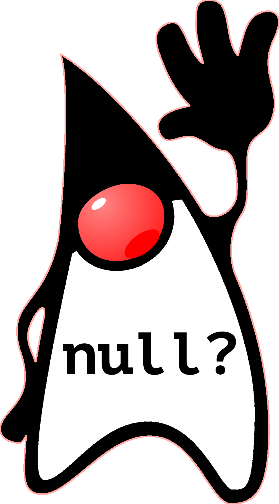

[.text-center]
= Null Safety in Java - The Past, Present, and Future

:figure-caption!:

ifdef::env-github[]
++++

  

++++
endif::[]

ifndef::env-github[]

endif::[]

[.text-center]
Explore the past, present, and future of null safety in Java +

[.text-center]
using the right patterns, tools, and language features

[cols="15%,85%",grid=none,frame=none]
|===
^.^a|[qrcode, format="png", xdim=4, subs=attributes, float=left]
....
https://github.com/malagupta/null-safety
....
.^a| {empty} +
*Link to content*: link:https://github.com/malagupta/null-safety-java[] +
&#160;
|===
'''

[caption=" ", .center, cols="<40%, ^20%, >40%", width=95%, grid=none, frame=none]
|===
| link:assets/docs/AboutSpeakers.adoc[◀️ About: Speaker]
| &nbsp;
| link:assets/docs/Agenda.adoc[Agenda ▶️]
|===

'''

[.text-center]
~Opinions&nbsp;are&nbsp;personal&nbsp;and&nbsp;do&nbsp;not&nbsp;represent&nbsp;views&nbsp;or&nbsp;opinions&nbsp;of&nbsp;any&nbsp;employer.~

